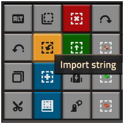

# FACTORIONOMICON ⚙️

Factorionomicon is my personal book of blueprints for Vanilla/Space Age gameplay which I've added modular and scalable designs to easen refactoring and starting from scratch. Also to share my friends and teach them how to play the game.

## How to import

You can import the book anytime in the game with the <kbd>Import String</kbd> button in the right side of the toolbox, as displayed below:

Paste the **gigantic wall of text** inside [Factorionomicon](FACTORIONOMICON.txt) in the propmpt, and voilà! The factory must grow!
